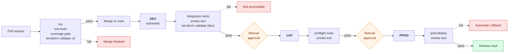

# saas-multi-env-test-pipeline

A reference implementation of environment promotion discipline for a SaaS
application on AWS: a change moves from pull request to DEV to UAT to PROD, and
at every step an automated gate decides whether it is allowed to continue.
Nothing reaches UAT without passing tests against DEV; nothing reaches PROD
without a human approval *and* a post-deploy smoke test that rolls the release
back on failure. The testing and QA machinery is the point of this repo — the
AWS side is deliberately kept simple and clean so the promotion logic is the
thing on display.

> **This repository does not deploy to any AWS account.** The GitHub Actions
> workflows genuinely run — tests, coverage gates, `terraform fmt` and
> `terraform validate` all execute in CI on every push and pull request — but
> no AWS credentials are configured, `terraform plan`/`apply` are never
> invoked, and no infrastructure is created. The steps that would deploy print
> the exact commands a live pipeline would run. See
> [Running this for real](#running-this-for-real).

## The pipeline



The full version of this diagram, with every branch and failure path, is in
**[docs/pipeline-flow.md](docs/pipeline-flow.md)**. The reasoning behind the
test layers and the coverage gate is in
**[docs/testing-strategy.md](docs/testing-strategy.md)**.

## What this demonstrates

**Automated testing**

- Unit tests over real business logic — a subscription pricing engine with
  seat overage tiers, annual discounting, mid-cycle proration and tax, tested
  at every tier boundary and on every rejection path
- Integration tests that start the actual server and drive it over HTTP,
  asserting status codes, headers, JSON bodies and the error contract — not
  in-process handler calls
- A smoke test that is a black-box `curl` check against a deployed URL, whose
  exit code is the release decision
- 90 tests across five suites; the whole suite runs in under a second

**Software QA**

- A coverage gate that fails the build below 80% globally and 95% on the
  pricing module, so a well-covered periphery cannot subsidise an untested
  money path — and branch coverage is included, so error paths must be
  exercised
- Environment promotion discipline: DEV is proven before UAT is offered, UAT is
  signed off before PROD is offered, and each promotion re-runs the full suite
  rather than trusting an earlier green
- UAT shaped like PROD (private subnets behind NAT, multiple tasks,
  autoscaling) so sign-off happens against something representative
- Infrastructure configuration treated as testable: every environment's tfvars
  file is evaluated against variable validation rules in CI

**DevOps / CI-CD**

- Three GitHub Actions workflows covering the whole path, with a matrix
  validating all three environments in parallel on every pull request
- Manual approval gates implemented as GitHub Environments with required
  reviewers, positioned *after* an automated preflight so no one is asked to
  approve something that cannot succeed
- Two independent rollback mechanisms: the ECS deployment circuit breaker for
  tasks that never become healthy, and a smoke-test-triggered rollback for
  releases that start up fine but behave wrongly
- One parameterised Terraform module reused across DEV, UAT and PROD, so the
  three environments are the same shape at different sizes

## Repository layout

```
app/                            Express API under test
  src/lib/pricing.js            Billing engine — the business logic worth unit testing
  src/lib/validation.js         Request parsing with per-field error reporting
  src/routes/                   CRUD + quote endpoints
  tests/unit/                   Isolated logic tests
  tests/integration/            Tests against a running server over HTTP
  jest.config.js                Coverage thresholds — the merge gate

terraform/
  main.tf                       Root module: network + app-environment
  modules/network/              VPC, public/private subnets, optional NAT
  modules/app-environment/      ECS Fargate service + ALB, autoscaling, circuit breaker
  environments/{dev,uat,prod}.tfvars   Same infrastructure, three sizes

.github/workflows/
  pr-checks.yml                 Gate 1 — lint, unit tests, coverage, validate x3
  deploy-dev.yml                Gate 2 — integration + smoke tests on merge to main
  promote.yml                   Gate 3 — approval-gated promotion to UAT or PROD

scripts/
  validate-terraform.sh         fmt + validate + evaluate one environment's tfvars
  smoke-test.sh                 Post-deploy black-box check; exit code = release decision
  rollback.sh                   Rollback trigger (dry-run by default)
```

## The application

A small subscription-billing API. It exists to give the pipeline something real
to test, so the endpoints do actual work rather than returning fixtures.

| Method | Path | Purpose |
| --- | --- | --- |
| `GET` | `/healthz` | Liveness — the ALB target group health check |
| `GET` | `/readyz` | Readiness, plus the environment and version it believes it is running |
| `GET` | `/api/v1/plans` | Plan catalogue |
| `GET` | `/api/v1/subscriptions` | List subscriptions, filterable by plan |
| `POST` | `/api/v1/subscriptions` | Create a subscription (validated, priced) |
| `GET` | `/api/v1/subscriptions/:id` | Fetch one, with its current price breakdown |
| `PATCH` | `/api/v1/subscriptions/:id` | Change plan/seats/cycle; reports upgrade vs downgrade |
| `DELETE` | `/api/v1/subscriptions/:id` | Cancel |
| `POST` | `/api/v1/billing/quote` | Price a hypothetical change, including mid-cycle proration |

The pricing engine handles per-plan included seats, volume-discounted seat
overage (5% / 15% / 25% tiers), annual billing at ten months, proration credits
on mid-cycle plan changes, and tax applied to the net amount. All money is
integer cents.

## Prerequisites

- **Node.js 20+** and npm — to run the app and its tests
- **Terraform 1.5+** — to validate the infrastructure (no AWS account needed)
- **curl** — used by the smoke test
- **bash** — used by the scripts

No AWS credentials are required for anything in this repo.

## Running it locally

```bash
# Install
cd app && npm install

# Lint
npm run lint

# Fast unit suite
npm run test:unit

# Integration suite (starts the server on an ephemeral port, hits it over HTTP)
npm run test:integration

# Everything, with the coverage gate enforced
npm run test:coverage
```

Start the app and smoke-test it the way the pipeline does:

```bash
cd app && APP_ENV=dev PORT=3000 npm start &
cd .. && ./scripts/smoke-test.sh http://127.0.0.1:3000 dev
```

Validate the infrastructure for each environment:

```bash
./scripts/validate-terraform.sh dev
./scripts/validate-terraform.sh uat
./scripts/validate-terraform.sh prod
```

Each of these runs `terraform fmt -check`, `terraform init -backend=false`,
`terraform validate`, and then loads that environment's tfvars file and
evaluates every variable validation rule against it. None of it contacts AWS.

## The environments

One module, three configurations. The shape is identical; the sizing,
resilience and cost are not.

| | DEV | UAT | PROD |
| --- | --- | --- | --- |
| Trigger | automatic on merge to `main` | manual dispatch | manual dispatch |
| Approval | none | required reviewer | required reviewer |
| VPC CIDR | `10.10.0.0/16` | `10.20.0.0/16` | `10.30.0.0/16` |
| Availability zones | 2 | 2 | 3 |
| NAT gateway | none (tasks in public subnets) | one, shared | one per AZ |
| Tasks | 1 | 2 | 3 |
| Task size | 256 CPU / 512 MiB | 512 / 1024 | 1024 / 2048 |
| Autoscaling | off | 2–4 tasks | 3–12 tasks |
| Log retention | 7 days | 30 days | 90 days |
| Deletion protection | off | off | **on** |
| Container Insights | off | off | **on** |

DEV skips the NAT gateway (the single largest always-on cost in a small
environment) and runs tasks in public subnets instead. UAT and PROD run tasks
in private subnets, which is what makes UAT a meaningful rehearsal for PROD.

## Manual setup required after cloning

Two things cannot be configured from within the repository and have to be set
in GitHub's UI. **Neither is done in this demo repo**, so the workflows here
run without pausing — configure them to make the gates enforcing.

### 1. Branch protection on `main`

Settings → Branches → Add branch ruleset for `main`:

- Require a pull request before merging
- Require status checks to pass → add **`PR gate`** (the aggregate job in
  `pr-checks.yml`, which depends on lint, unit tests, the coverage gate and all
  three Terraform validations)
- Require branches to be up to date before merging

Without this, `pr-checks.yml` still runs and still reports failure — it just
does not physically prevent a merge.

### 2. Required reviewers on the `uat` and `prod` environments

Settings → Environments → `uat` (and `prod`) → **Required reviewers**.

The `dev`, `uat` and `prod` environments already exist — GitHub created them
the first time each workflow referenced one — so this is only a matter of
adding reviewers to `uat` and `prod`.

This is what turns `promote.yml` into an approval gate: with reviewers
configured, the `promote` job pauses and waits for a named human before any
promotion step runs. Environment protection rules cannot be set reliably from
`gh` non-interactively, so this is a manual step. Also worth adding here:

- **Deployment branches**: restrict `prod` to `main` only
- **Wait timer**: a short delay before PROD promotions, if you want one

## Running this for real

To turn this from a demonstration into a working deployment pipeline:

1. **Containerise the app** — add a `Dockerfile` to `app/` and an ECR
   repository per environment (or one repository with immutable tags).
2. **Set up remote state** — uncomment the `backend "s3"` block in
   `terraform/providers.tf` and create one state key per environment, with a
   DynamoDB table for locking.
3. **Give the workflows an AWS identity** — configure GitHub OIDC with one IAM
   role per environment, add `permissions: id-token: write` to the deploying
   jobs, and use `aws-actions/configure-aws-credentials@v4`. Scope the PROD
   role to the `prod` environment so a DEV job cannot touch PROD.
4. **Replace the simulated deploy steps** — in `deploy-dev.yml` and
   `promote.yml`, swap the `echo` blocks for the commands they print:
   ```bash
   docker build -t "$ECR_REPO:$GITHUB_SHA" app/ && docker push "$ECR_REPO:$GITHUB_SHA"
   terraform apply -auto-approve \
     -var-file="environments/${ENVIRONMENT}.tfvars" \
     -var "container_image=$ECR_REPO:$GITHUB_SHA" \
     -var "app_version=$GITHUB_SHA"
   ./scripts/smoke-test.sh "$(terraform output -raw service_url)" "$ENVIRONMENT"
   ```
5. **Promote plan to a gate** — add `terraform plan -var-file=... -detailed-exitcode`
   to the PR checks so infrastructure diffs are reviewed on the pull request.
6. **Arm the rollback** — set `DRY_RUN=false` in the rollback step of
   `promote.yml` so `scripts/rollback.sh` actually calls `aws ecs update-service`
   instead of printing what it would do.
7. **Add HTTPS** — an ACM certificate, a 443 listener, and a redirect from 80.

## Verified

Everything below was run before this repo was published:

- Full suite: **90 tests across 5 suites, all passing**
- Coverage: **99.5% statements, 96.7% branches**, above both thresholds
- The coverage gate was deliberately broken (by removing the pricing unit
  tests) to confirm it fails the build — 45 tests still passed and the run
  still exited 1 — then restored
- The tfvars validation gate was deliberately broken (an illegal `task_cpu`
  value in `dev.tfvars`) to confirm it exits 1, then restored
- `terraform fmt -recursive -check` clean
- `terraform init -backend=false && terraform validate` clean for dev, uat and
  prod
- The smoke test was run against a locally started instance, passing on a
  correct environment and failing on a mismatched one
- `terraform plan` and `terraform apply` were **never** run

## License

MIT — see [LICENSE](LICENSE).
