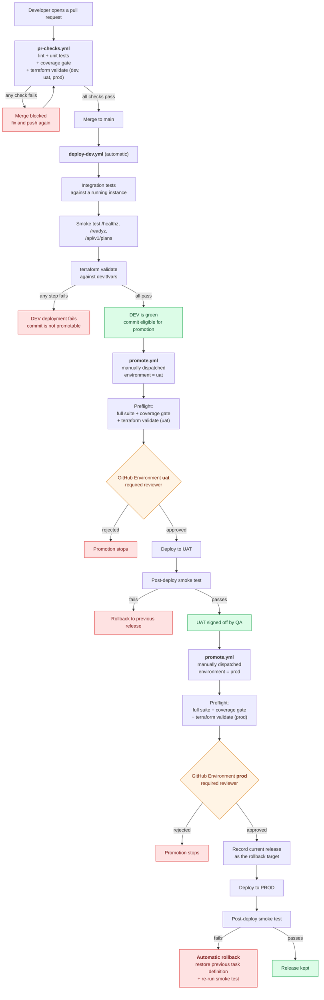

# Pipeline flow

How a change travels from a pull request to production, and what has to be
true at each step before it is allowed to continue.

## The whole path

## Walkthrough

### 1. Pull request — nothing merges unreviewed or untested

Opening a PR against `main` runs **`.github/workflows/pr-checks.yml`**:

- `npm run lint` — ESLint over the whole app
- `npm run test:unit` — the fast unit suite, for quick feedback
- `npm run test:coverage` — the whole suite with Jest's coverage thresholds
  applied. Jest exits non-zero when coverage drops below 80% overall or 95% on
  the pricing module, which fails the job even though every test passed.
- `terraform fmt -check` and `terraform validate` for **all three** environments
  in parallel, so a change that would break the PROD configuration is caught on
  the PR rather than at promotion time.

A final `pr-gate` job depends on all of the above; that is the single check to
mark as required in branch protection.

### 2. Merge to main — DEV deploys automatically

Merging runs **`.github/workflows/deploy-dev.yml`**. DEV has no approval gate:
it is the environment that exists to tell you whether `main` is deployable.

- The integration suite starts the real Express app on an ephemeral port and
  drives it over HTTP — real status codes, real JSON, real error paths.
- `scripts/smoke-test.sh` then runs against a separately started instance, the
  same script a live pipeline would point at the DEV load balancer.
- `scripts/validate-terraform.sh dev` validates the configuration and evaluates
  `environments/dev.tfvars` against every variable validation rule.

If all of that passes, the commit is eligible for promotion. If any of it
fails, the commit is not — there is no way to promote past a red DEV.

### 3. Promotion to UAT — first human gate

**`.github/workflows/promote.yml`** is dispatched manually with
`environment: uat`. Two things happen in order:

1. **Preflight**, before any approval is requested: the full test suite with
   the coverage gate, plus `terraform validate` against `uat.tfvars`. Nobody
   should be asked to approve a promotion that cannot succeed.
2. **The approval gate.** The `promote` job declares
   `environment: ${{ inputs.environment }}`. With required reviewers configured
   on the `uat` GitHub Environment, the job pauses here until a named human
   approves it.

After approval the release is deployed and the post-deploy smoke test runs.
UAT is intentionally shaped like PROD — private subnets behind NAT, more than
one task, autoscaling enabled — so QA is signing off on something
representative rather than on a toy.

### 4. Promotion to PROD — second human gate plus a safety net

The same workflow with `environment: prod`, so the same preflight and the same
approval mechanism, this time against the `prod` GitHub Environment. Two extra
things matter here:

- **The rollback target is recorded before anything changes.** The job captures
  the currently deployed task definition revision first, so the rollback path
  is known-good rather than reconstructed under pressure.
- **The smoke test is the release decision.** It polls `/healthz` until the new
  tasks answer, asserts `/readyz` reports the expected environment, and checks
  that a real business endpoint serves data. A non-zero exit fails the job and
  runs `scripts/rollback.sh`, which points the ECS service back at the previous
  revision, waits for it to stabilise, and re-runs the smoke test against the
  restored release.

There are two independent rollback mechanisms, covering different failures:

| Failure | Caught by | Mechanism |
| --- | --- | --- |
| New tasks never become healthy | AWS | ECS deployment circuit breaker (`deployment_circuit_breaker { rollback = true }`) reverts the service automatically |
| Tasks are healthy but the app is wrong | The pipeline | Smoke test fails → `scripts/rollback.sh` restores the previous task definition |

The first is infrastructure-level and needs no pipeline at all. The second is
the one that catches a bad release that technically starts up fine — a broken
pricing calculation, a missing environment variable, a dependency that is
reachable in UAT but not in PROD.

## What runs where

| Stage | Trigger | Approval | Tests run | Terraform |
| --- | --- | --- | --- | --- |
| PR checks | `pull_request` | none | lint, unit, full suite + coverage gate | `fmt -check` + `validate` for dev, uat, prod |
| DEV | push to `main` | none | integration, smoke | `validate` against `dev.tfvars` |
| UAT | manual dispatch | required reviewer | full suite + coverage gate, smoke | `validate` against `uat.tfvars` |
| PROD | manual dispatch | required reviewer | full suite + coverage gate, smoke | `validate` against `prod.tfvars` |

## Where this repo stops

Everything above runs for real in GitHub Actions except the deployment itself.
No AWS credentials are configured, `terraform apply` is never invoked, and no
resources are created. The steps that would deploy print the exact commands a
live pipeline would run; the test, validation, approval, smoke-test and
rollback machinery around them is genuine.
